# Developer Guide

## Acknowledgements

{list here sources of all reused/adapted ideas, code, documentation, and third-party libraries -- include links to the
original source as well}
***
## Design & implementation

### Feature: Add Pet
The diagram below shows how the `AddPetCommand` class interacts with other
components in the system.

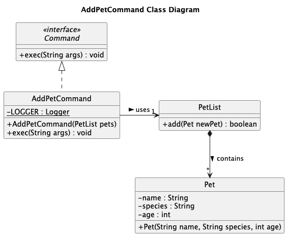

This design follows a command-based architecture, where each command is
encapsulated in its own class implementing the `Command` interface.
`AddPetCommand` depends on the `PetList` object, which stores all registered
pets. Each `Pet` object maintains information about its name, species, and age.

When executed, the command performs the following steps:
1. Parses user input to extract the pet's name (`n/`), species (`s/`), and
age (`a/`)
2. Validates the input fields
3. Creates a new `Pet` object with the parsed parameters
4. Adds the new pet to the pet list using `addPet()`
5. Handles duplicates and disregards the addition of the
pet if the duplicate exists
6. Displays and logs activity

The `AddPetCommand` ensures that only valid and unique pets are added to the
pet list. It emphasizes input validation, duplicate prevention, and
error handling, while maintaining logging for debugging/monitoring execution.

### Feature: Delete Pet
This feature is built using the Command Pattern. This design decouples the invoker 
(main app logic) from the operation itself by using a Command interface. 
The DeletePetCommand is a concrete implementation of this interface that contains 
all the logic for parsing and execution.


As shown in the class diagram above, the DeletePetCommand does not manage the list directly. 
Instead, it holds a reference to a PetList instance (a "has-a" relationship, 
or Aggregation) that is provided to its constructor. This use of Dependency 
Injection makes the command highly testable, as the PetList can be easily mocked.

The execution flow starts when the exec method is called with the user's input. 
The command parses the string to find the pet's name, then validates the input by 
querying the PetList. If the syntax is correct and the pet exists, the 
command instructs the PetList to perform the actual deletion. The DeletePetCommand 
is also responsible for printing all relevant success or error messages to the user.

The detailed interaction between the main app (CuddleCare), DeletePetCommand, and 
PetList during execution is illustrated in the sequence diagram below.

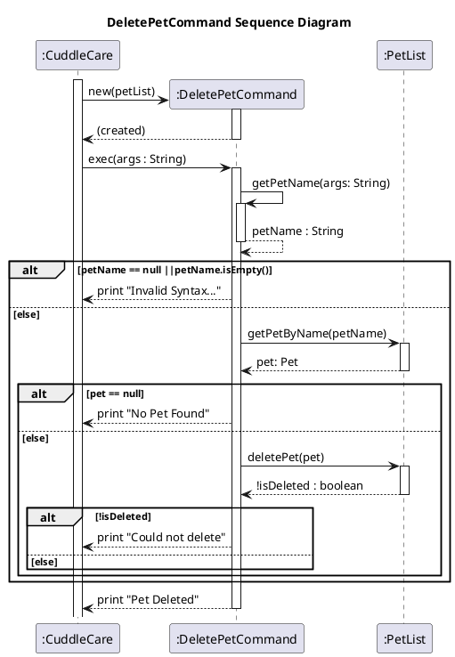
***
### Feature: Edit Pet


**Purpose**: Edit an existing pet’s properties. Only provided fields are changed.

**Command word**: `edit-pet`

**Format**
```
edit-pet n/OLD_NAME [nn/NEW_NAME] [s/SPECIES] [a/AGE]
```

**Arguments**
- `n/OLD_NAME` *(required)* – name of the pet to edit.
- `nn/NEW_NAME` *(optional)* – new name to assign.
- `s/SPECIES` *(optional)* – new species.
- `a/AGE` *(optional)* – integer age (non-negative).

**Examples**
```
edit-pet n/Milo nn/Millie a/4
edit-pet n/Lucky s/Dog
edit-pet n/Tama a/12
```

**Success behaviour**
- Finds the pet by `OLD_NAME`. Updates only the tokens present. Prints a success line with the edited pet.

**Failure cases & messages**
- Missing `n/`: prints usage line.
- Pet not found: `Pet not found.`
- No editable tokens provided (`nn/`, `s/`, `a/` all absent): `Nothing to edit.`
- `a/` not an integer: `Age must be a valid number.`

**Logging**
- INFO: start/end; edited fields.
- WARNING: invalid tokens/number format; pet missing.
***
### Feature: List Pets

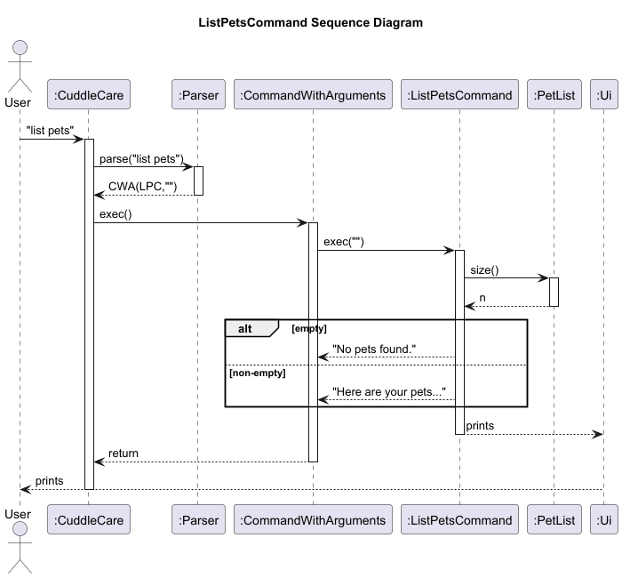

**Purpose**: Display all pets maintained in memory.

**Command word**: `list pets`

**Format**
```
list-pets
```

- Prints an enumerated list (1-based) of all pets, each rendered via `Pet#toString()`.
- If empty, prints `No pets found.`

**Behaviour**
- Iterates `PetList` from index `0..size-1` and prints `(i+1) + ". " + pet.toString()`.

**Failure cases & messages**
- None (arguments are ignored). If the list is empty, shows the friendly message above.

**Logging**
- INFO on command entry/exit; FINE for iteration count.
***
### Feature: Add Treatment
The diagram below shows how the AddTreatmentCommand class interacts with other components in the system.


The design follows a command-based architecture, where each command is encapsulated in its own class implementing the
Command interface. AddTreatmentCommand depends on the PetList object, which stores all registered pets. Each Pet object
maintains a list of Treatment objects.

When executed, the command:

1. Parses user input to extract the pet name (`n/`), treatment name (`t/`), and date (`d/`)
2. Retrieves the corresponding Pet object from the PetList using `getPetByName()`
3. Validates the date format using `LocalDate.parse()`
4. Creates a new Treatment object with the validated parameters
5. Adds the treatment to the pet's treatment list via `addTreatment()`
6. Displays a confirmation message or error if validation fails

The command validates all inputs before modifying the pet's treatment list. If the pet is not found or the date format
is invalid, appropriate error messages are displayed.
***
### Feature: Delete Treatment
The figure below shows how the DeleteTreatmentCommand interacts with other key classes in the system.


The DeleteTreatmentCommand follows a command-based architecture, where each command is encapsulated in its own class
implementing the Command interface.

When the command is executed:
1. User input is parsed to extract the pet's name (`n/`) and treatment index (`i/`)
2. Command retrieves the corresponding Pet object from the PetList using `getPetByName()`
3. Validates that the index is within valid bounds
4. Converts the 1-based user index to 0-based array index
5. Removes the treatment from the pet's list using `removeTreatment()`
6. Displays a confirmation message with the deleted treatment's name

If the pet is not found or the index is invalid, the command prints an appropriate error message.
***
#### Design Considerations

Alternative 1 (current choice): Use index-based deletion.

Pros:
* Always deletes exactly one specific treatment.
* Easier for user to type out.

Cons:
* Requires users to know or look up the index.

Alternative 2: Use treatment name for deletion.

Pros:
* More intuitive for users who remember treatment names.

Cons:
* Ambiguous when multiple treatments have similar names.
* Requires additional confirmation steps.
***
### Feature: Find Treatment
The FindCommand allows users to search for treatments across all pets by matching a keyword against treatment names. 
The search is case-insensitive and uses substring matching.

The sequence diagram below illustrates the execution flow of the find treatment command:


Implementation
The find treatment mechanism is facilitated by `FindTreatmentCommand`. It performs a case-insensitive keyword search 
across all treatments for all pets in the system. The search uses substring matching, allowing partial keyword matches.

Key operations:
* `PetList#getAllPets()` — Retrieves all pets in the system. 
* `Pet#getTreatments()` — Gets the treatment list for each pet. 
* String comparison using `toLowerCase()` and `contains()` for matching.

Command format: `find-treatment KEYWORD`

When the command is executed:
1. User input is parsed to extract the search keyword 
2. The keyword is validated (must not be empty)
3. Command retrieves all pets from `PetList` 
4. For each pet, the command iterates through its treatments 
5. Each treatment name is checked against the keyword (case-insensitive substring match)
6. Matching treatments are collected with their pet names and dates 
7. Results are displayed to the user, or a "No treatments found" message if no matches
***
### Feature: Filter Treatments By Date
The FilterTreatmentCommand enables users to view all treatments that fall within a specified date range across all pets 
in the system.

The sequence diagram below shows the execution flow when filtering treatments by date:


The filter treatments by date range feature is facilitated by `FilterTreatmentCommand`. It allows users to view all 
treatments that fall within a specified date range across all pets in the system.

The implementation involves the following operations:
* `PetList#getAllPets()` — Retrieves all pets. 
* `Pet#getTreatments()` — Gets treatments for filtering. 
* `Treatment#getDate()` — Retrieves the treatment date for comparison. 
* Date comparison using `LocalDate#isAfter()` and `LocalDate#isBefore()`.

Command format: `filter-treatment start/START_DATE end/END_DATE`

When the command is executed:
1. User input is parsed to extract start date and end date 
2. Both dates are validated using `LocalDate.parse()`
3. The command checks that start date is not after end date 
4. Command retrieves all pets from `PetList`
5. For each pet, the command iterates through its treatments 
6. Each treatment's date is checked against the date range (inclusive)
7. Matching treatments are collected and displayed to the user
***
### Feature: Mark a treatment as done
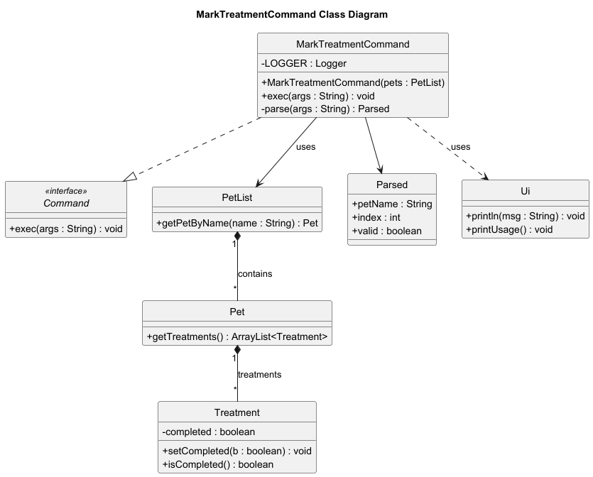


**Purpose**: Mark a specific treatment (by per‑pet local index) as completed.

**Command word**: `mark`

**Format**
```
mark n/PET_NAME i/INDEX
```
- `n/PET_NAME` *(required)* – the pet to operate on.
- `i/INDEX` *(required)* – 1‑based index into that pet’s treatment list.

**Examples**
```
mark n/Milo i/2
```

**Success behaviour**
- Sets `Treatment#setCompleted(true)` for the selected treatment. Prints a confirmation containing pet name and treatment info.

**Failure cases & messages**
- Missing `n/` or `i/`: prints usage line.
- Pet not found: `No such pet.`
- `i/` not an integer: `Invalid index.`
- Index out of bounds: `Invalid treatment index.`

**Logging**
- INFO on success with (petName, index).
- WARNING for invalid input or lookups.
***
### Feature: Mark a treatment as not done


**Purpose**: Unmark a specific treatment (by per‑pet local index) as not completed.

**Command word**: `unmark`

**Format**
```
unmark n/PET_NAME i/INDEX
```

**Examples**
```
unmark n/Milo i/2
```

**Success behaviour**
- Sets `Treatment#setCompleted(false)` for the selected treatment.

**Failure cases & messages**
- Same validation and messages as `mark`.

**Logging**
- Same as `mark`.
***
### Feature: List All Treatments across all pets
#### Design

The diagram below shows how the `ListAllTreatmentsCommand` class interacts with other components in the system.

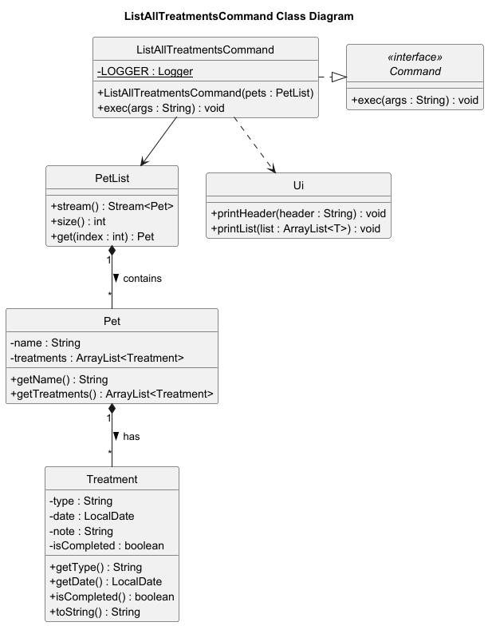

The design follows a command-based architecture, where each command is encapsulated in its own class
implementing the `Command` interface.\
`ListAllTreatmentsCommand` depends on the PetList object, which stores all registered pets. Each `Pet`
object maintains a list of `Treatment` objects.

When executed, the command iterates through each `Pet` in the `PetList`, retrieves its treatments,
and formats them into displayable strings. The command then sorts all treatments by their dates in
ascending order before printing them to the console.


***
### Feature: List All Treatments of a pet
#### Design

The figure below shows how the `ListPetTreatmentsCommand` interacts with other key classes in the system.


The `ListPetTreatmentsCommand` follows a command-based architecture, where each command is encapsulated
in its own class implementing the `Command` interface.

When the command is executed:

1. user input is parsed to extract the pet’s name (n/PET_NAME)
2. command retrieves the corresponding Pet object from the PetList using getPetByName().
3. then obtains the list of treatments from the Pet object via getTreatments().
4. displays the list of treatments in a numbered format. If the pet has no logged treatments,
   or if the pet is not found, the command prints a message.

The sequence diagram is given below to show the execution of the list all treatments of a pet command.
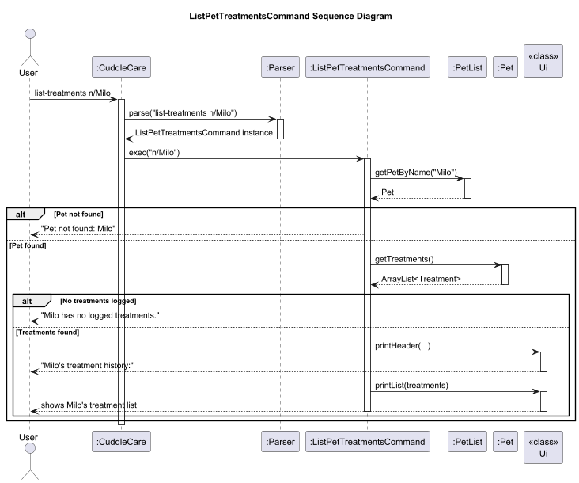
***
### Feature: Summary of Completed Treatments

The figure below shows how the `SummaryCommand` interacts with other key classes in the system.
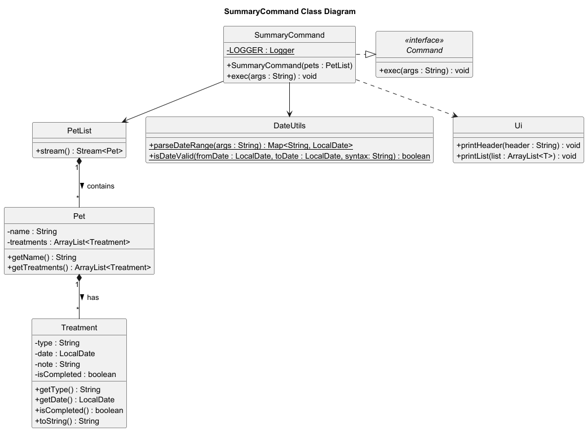

When the command is executed:

1. user input is parsed to extract the date range using the `DateUtils` class.
2. validates the date range to ensure that the fromDate is not after the toDate.
3. iterates through the list of pets in the PetList and collects all Treatment records that:
   * Fall within the specified date range, and
   * Have been marked as completed
4. displays the summary report using the Ui class

The sequence diagram is given below to show the execution of the summary command.
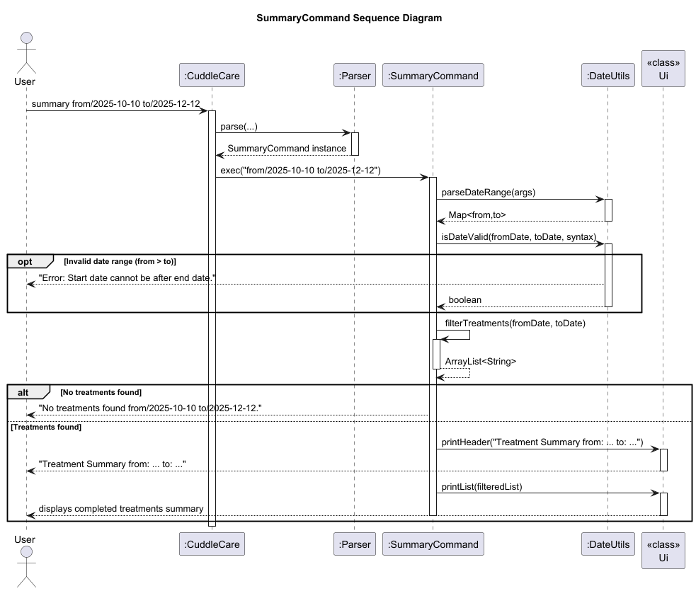

***
### Feature: Group Treatments by type
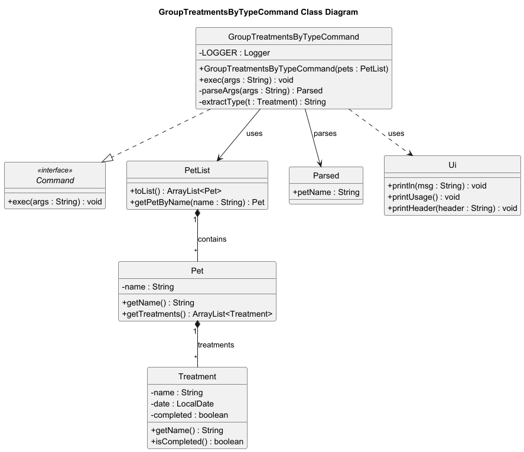


**Purpose**: Group treatments by **type** across the dataset, then print each group with its members.

**Command word**: `group-treatments-by-type`

**Format**
```
group-treatments-by-type
```
*(If your parser supports `n/PET_NAME`, the command may accept `group-treatments-by-type n/NAME` to scope by a single pet; otherwise it groups across all pets.)*

**Examples**
```
group-treatments-by-type
```

**Success behaviour**
- Flattens `(pet, treatment)` rows across `PetList`, then buckets by type using `extractType(treatment)`.
- Prints each type header followed by entries: `(petName, treatmentName, date, completed)`.

**Failure cases & messages**
- No treatments anywhere: `No treatments logged.`

**Notes**
- A simple default for `extractType` is to use `Treatment#getName()` as the key, or the first token before a colon/space if you want coarse types.
- Sorting of buckets/rows is cosmetic and optional.

**Logging**
- INFO summarising bucket counts; FINE for per‑bucket sizes.
***
### Feature: Overdue Treatments Command
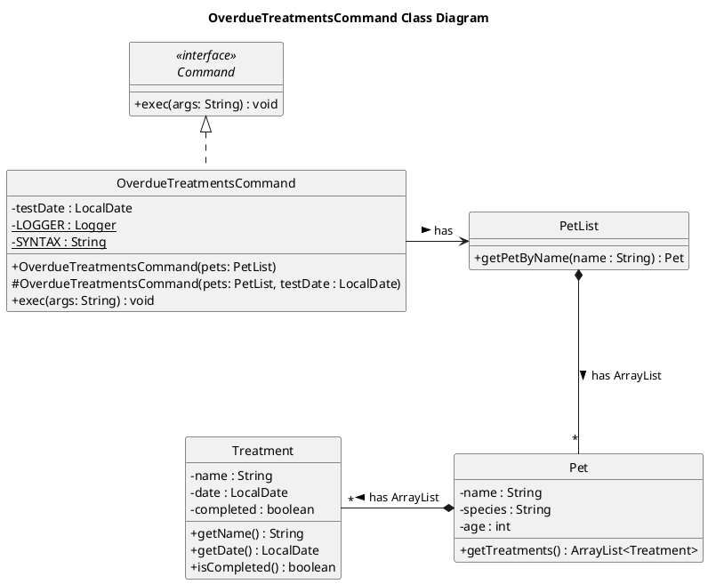
The `OverdueTreatmentsCommand` displays all treatments that are overdue for pets. It can show overdue treatments for a specific pet if the pet name is provided, or for all pets if no name is given. A treatment is considered overdue if it is **not completed** and its scheduled date is **before today**.

This command follows the **Command Pattern**, encapsulating all logic related to listing overdue treatments in a dedicated class implementing the `Command` interface. It depends on a `PetList` instance, injected via its constructor, and optionally allows a custom date for testing purposes.

**Execution flow**:
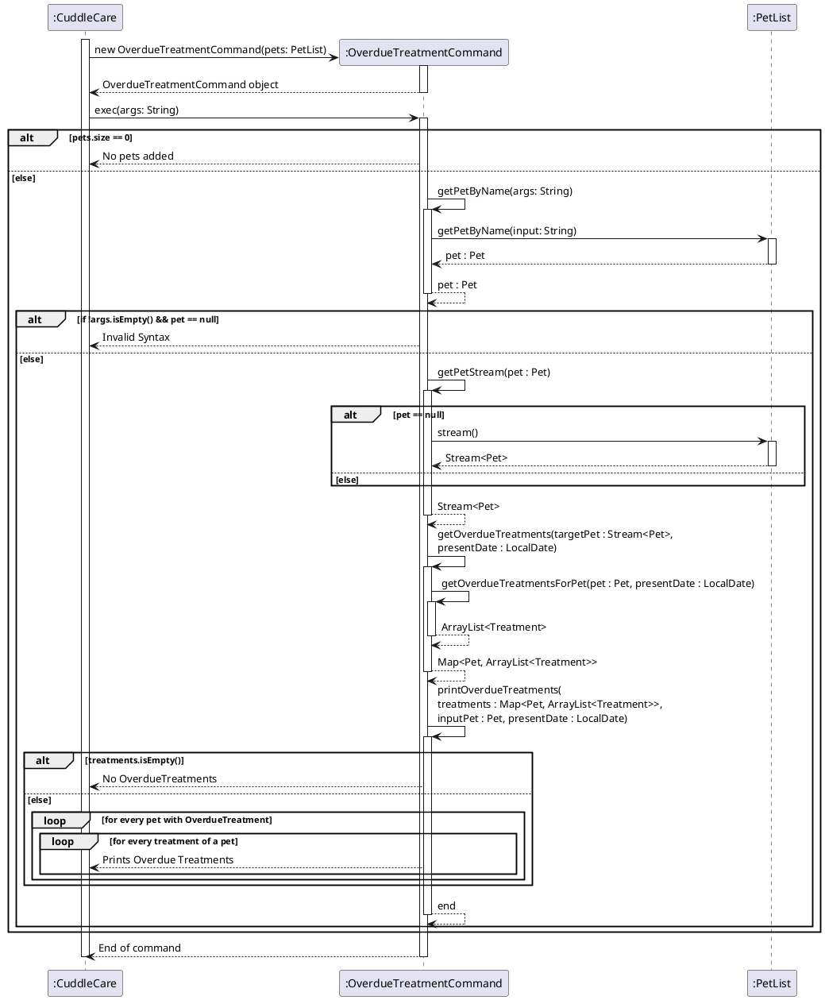
1. The command is executed via `exec(String args)`.
2. Parses optional argument `n/PET_NAME` to determine if the user wants overdue treatments for a specific pet.
3. Validates the argument:
    - Prints syntax error if the input format is invalid.
    - Prints a message if the specified pet does not exist.
4. Determines the current date (or uses the provided test date for testing).
5. Collects all overdue treatments:
    - Iterates through the relevant pet(s).
    - Filters treatments where `isCompleted()` is `false` and `getDate()` is before the current date.
6. Prints the overdue treatments in a readable format, including:
    - Pet name (if displaying for all pets)
    - Treatment name
    - Scheduled date
    - Number of days overdue
7. If no overdue treatments exist, prints a friendly message.

**Design Considerations**:

- Supports both **all pets** and **single pet** modes using streams.
- Uses **Dependency Injection** for `PetList` and optional test date.
- Separates filtering logic (`getOverdueTreatmentsForPet`) from printing logic (`printOverdueTreatments`) for clarity and testability.
- Handles empty pet list and missing pet gracefully.
- Logs execution steps, invalid inputs, and command success for monitoring.

**Logging**:

- `INFO` when command is executed with arguments.
- `INFO` for invalid arguments or missing pets.
- `INFO` when no overdue treatments are found.
- `INFO` on successful execution with results printed.
***
### Feature: Summary
{add details here}
***
### Feature: Help Command
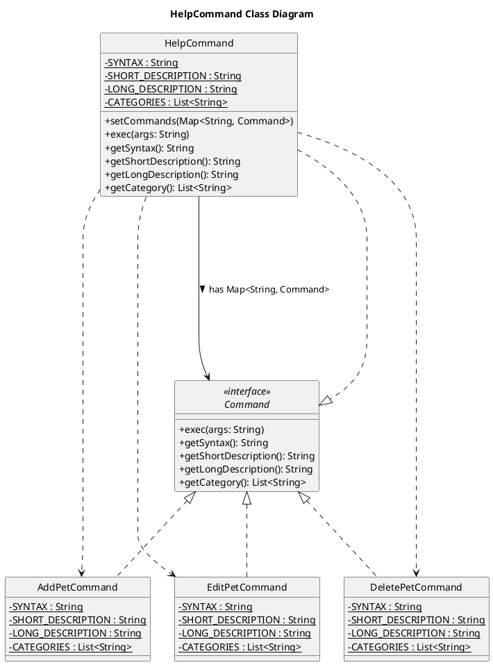  
The HelpCommand provides users with guidance on available commands in the application. It can either display all commands grouped by category or show detailed information for a specific command using the optional `c/COMMAND_NAME` argument.

This feature follows the **Command Pattern**, encapsulating all help-related logic in its own class that implements the `Command` interface. The HelpCommand depends on a map of all commands (`Map<String, Command>`) that is set via `setCommands(Map)`.

**Execution flow**:
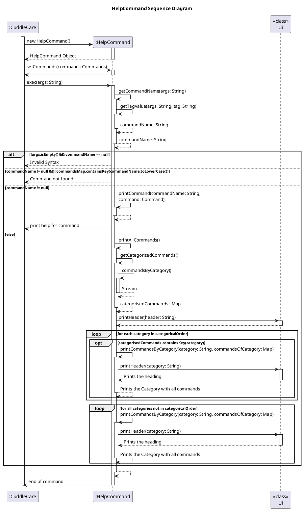
1. The command is executed via `exec(String args)`.
2. Parses optional argument `c/COMMAND_NAME` to determine if help for a specific command is requested.
3. Validates the argument:
    - If the syntax is invalid, prints the help command syntax.
    - If a specific command is requested but not found, prints an error message.
4. If a valid command name is provided, prints detailed information including:
    - Command name
    - Category
    - Long description
    - Syntax
5. If no command name is provided, prints all commands grouped by their category, respecting a predefined order (`General`, `Pet`, `Treatment`) and sorting remaining categories alphabetically.

**Design Considerations**:

- Uses **Dependency Injection** to receive the `commandsMap`, making it testable.
- Categorizes commands dynamically using streams and collectors.
- Supports optional arguments via a tag-based parsing mechanism (`c/COMMAND_NAME`).
- Logs command execution, invalid syntax, and missing commands for monitoring.

**Logging**:

- `INFO` on command execution, printing all commands or specific command.
- `INFO` on invalid syntax or missing command.
- Maintains clear separation of concerns between argument parsing, categorization, and printing.
***
### Feature: Bye Command

The `ByeCommand` allows users to **exit the application** gracefully. When executed, it prints a farewell message and terminates the program.

This command follows the **Command Pattern**, encapsulating the exit behavior in a dedicated class implementing the `Command` interface. It does not require any dependencies or arguments.

**Execution flow**:
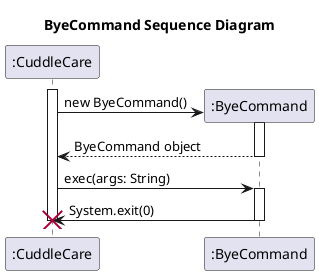
1. The command is executed via `exec(String args)`.
2. Prints a farewell message to the console: `Bye bye, Have a wonderful day ahead :)`
3. Terminates the application using `System.exit(0)`.

**Design Considerations**:

- Simple, single-responsibility command.
- Ignores any arguments passed, ensuring a consistent exit behavior.
- Logs or monitoring is not necessary due to its terminal effect.
- Follows a **General** category, as it pertains to application lifecycle.

**Logging**:

- N/A — the command immediately exits the application after printing the message.

***
## Product scope

### Target user profile

{Describe the target user profile}

### Value proposition

{Describe the value proposition: what problem does it solve?}

## User Stories

| Version | As a ... | I want to ...             | So that I can ...                                           |
|---------|----------|---------------------------|-------------------------------------------------------------|
| v1.0    | new user | see usage instructions    | refer to them when I forget how to use the application      |
| v2.0    | user     | find a to-do item by name | locate a to-do without having to go through the entire list |

## Non-Functional Requirements

{Give non-functional requirements}

## Glossary

* *glossary item* - Definition

## Instructions for manual testing

1. **List Pets: list all pets**
    1. `list-pets`
2. **Edit pet: rename and age**
    1. `add-pet n/Milo s/Dog a/3`
    2. `edit-pet n/Milo nn/Millie a/4`
    3. `list-pets` → verify updated name/age.
3. **Mark → Unmark**
    1. `add-treatment n/Millie t/"Vaccine A" d/2024-01-10`
    2. `list-treatments n/Millie` → note index
    3. `mark n/Millie i/<index>` → verify `[X]`
    4. `unmark n/Millie i/<index>` → verify `[ ]`
4. **Group by type (per pet & all)**
    1. Add mixed treatments (e.g., Vaccine A / Checkup).
    2. `group-treatments n/Millie` → check order & headers.
    3. `group-treatments` → verify cross-pet listing & sort.